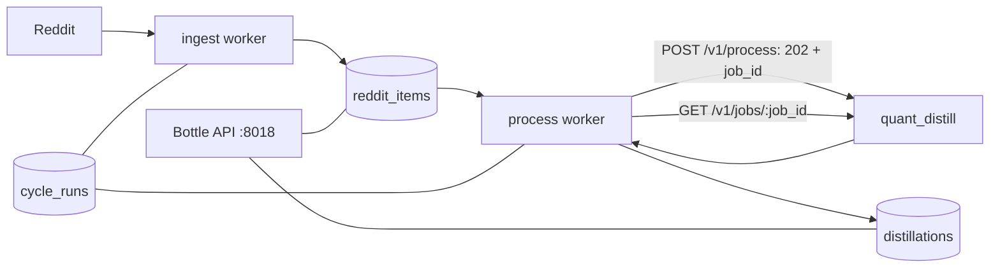

# Architecture

`quant_reddit` owns Reddit discovery and local audit persistence. Shared LLM
processing and any downstream artifact delivery are outside this service.

## Ownership

| Component | Responsibility |
|---|---|
| `reddit_client.py` | Reddit discovery, filtering, truncation, and idempotent ingestion |
| `distill_client.py` | Request mapping, async job submit/poll, and HTTP retries |
| `orchestrator.py` | Item state transitions (`new` → `submitted` → `distilled`/`failed`) and worker run loops |
| `repository/` | Source records, exact API requests/responses, cursors, and run history |
| `routes/` | Health, statistics, and audit reads |

## Persistence

- `reddit_items`: raw source content keyed by Reddit fullname, plus the in-flight
  `job_id`/exact request for items in the `submitted` state.
- `distillations`: one exact `/v1/process` request and authoritative job result per
  source item, including the upstream request ID. Written once a polled job reaches
  `succeeded`.
- `ingest_cursor`: source watermarks and worker heartbeat.
- `cycle_runs`: ingest/process start, finish, result, and error records.

The pre-existing `llm_extractions` and `emission_log` tables are not used by current
code. Migration `0003_distillations` leaves them intact to avoid destructive loss of
historical audit data.
