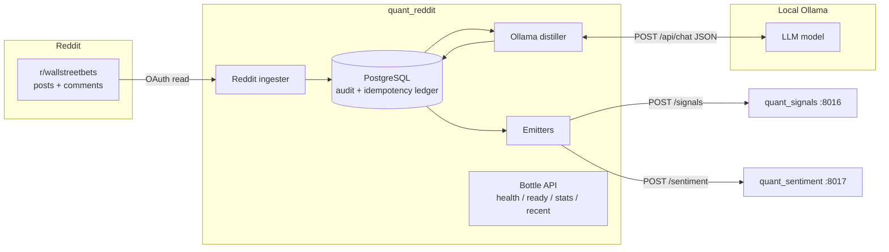

# Spec: `quant_reddit` — Reddit WallStreetBets → Ollama → Watchlist Signals + Sentiment

## Summary

`quant_reddit` is a **producer** service for the quant/algo platform. It continuously
reads posts and comments from Reddit's r/wallstreetbets, sends the text to a **local
Ollama LLM** to distill structured investment signals, and emits two kinds of output to
existing platform services:

1. **Watchlist signals** → [`quant_signals`](https://github.com/mayberryjp/quant_signals) via `POST /signals`.
2. **Sentiment observations** → [`quant_sentiment`](https://github.com/mayberryjp/quant_sentiment) via `POST /sentiment`.

It is a producer/aggregator only: it does **not** manage the watchlist lifecycle (that is
`quant_signals`), it does **not** aggregate sentiment over time (that is `quant_sentiment`),
and it does **not** place trades. Its own datastore is an audit/idempotency ledger, not a
system of record for signals or sentiment.

This spec follows the platform conventions established in
[`quant_sentiment`](https://github.com/mayberryjp/quant_sentiment) and
[`quant_daily_bars`](https://github.com/mayberryjp/quant_daily_bars), and is organized into
vertical **slices** (Slice 0–8), each independently shippable and tested.

---

## Architecture

**Pipeline:** `ingest → distill → emit`, run continuously by a supervisord-managed worker,
with a sibling Bottle API process for health/readiness/stats/read endpoints — mirroring the
`[program:api]` + worker layout used by `quant_signals`.

---

## Coding standards & conventions (inherited from the platform)

These are mandatory and mirror `quant_sentiment` / `quant_daily_bars`:

- **Python 3.12**, `from __future__ import annotations` in every module.
- **Build:** `setuptools` + `pyproject.toml`, package version `0.1.0`.
- **Web framework:** `bottle` served by `waitress` (`serve(app, host, port, threads=20)`).
- **Config:** `pydantic-settings` `BaseSettings` with `env_prefix="QUANT_REDDIT_"`;
  `DATABASE_URL` and external vendor creds (Reddit, Ollama) read unprefixed (as
  `quant_daily_bars` does with `MASSIVE_API_KEY`).
- **Models:** `pydantic` `BaseModel` with `Field(...)` constraints for all request/response
  and LLM-output schemas.
- **Persistence:** SQLAlchemy **Core** (not ORM); portable JSON via
  `sa.JSON().with_variant(JSONB(), "postgresql")`; every table carries a `schema_version`
  column; dedup enforced with `UNIQUE` constraints.
- **Migrations:** Alembic with a dedicated version table `alembic_version_reddit`; URL
  from `DATABASE_URL`; migrations run on container start.
- **App layout** (`app/` package):
  - `app/main.py` — `create_app()` merges route sub-apps, registers JSON error handlers;
    `__main__` starts waitress.
  - `app/config.py` — `Settings(BaseSettings)`, module-level `settings`.
  - `app/db.py` — lazy engine from `DATABASE_URL`, `get_engine()` / `set_engine()`.
  - `app/dependencies.py` — `get_repo()` / `set_repo()` for DI + test injection.
  - `app/models/` — `domain.py`, `requests.py`, `responses.py`.
  - `app/repository/` — `schema.py` (Core tables), `postgres.py` (repositories).
  - `app/routes/` — `health.py`, `reddit.py` (each exposes a Bottle `sub`).
  - `app/services/` — `reddit_client.py`, `ollama_client.py`, `distiller.py`,
    `signal_emitter.py`, `sentiment_emitter.py`, `orchestrator.py`.
  - `app/timeutil.py`.
- **Endpoints convention:** `/reddit/health` (liveness, no DB), `/reddit/ready`
  (503 if DB / dependencies unreachable), `/reddit/stats` (operational counters).
- **Error envelopes:** JSON `{"detail": "..."}`; `422` for validation, `404` for not found.
- **Testing:** `pytest` + `webtest` `TestApp`; in-memory SQLite with a
  `schema_translate_map`; `conftest.py` fixtures (`engine`, `repo`, `app_client`); test
  files named `test_slice<N>_<name>.py`. **No live network / DB / LLM in tests** — Reddit,
  Ollama, and downstream HTTP are exercised via fixtures/stubs.
- **Container:** `python:3.12-slim`, `PYTHONUNBUFFERED=1`, `PYTHONDONTWRITEBYTECODE=1`,
  `supervisor` installed via apt; `CMD ["/bin/sh","-c","alembic upgrade head && supervisord -c /app/supervisord.conf -n"]`.
- **supervisord.conf:** `nodaemon=true`, logs to `/dev/stdout` + `/dev/stderr`, programs
  `autostart=true autorestart=true startretries=3`.
- **Docs:** `docs/architecture.md`, `docs/producer_mapping.md`, `docs/runbook.md`.
- **CI:** `.github/workflows/` developer-agent workflow + `docker-publish.yml`.
- **Design principle — graceful degradation:** a failure ingesting/distilling/emitting one
  item never aborts the batch; failures are counted and reported, remaining items proceed
  (as in `quant_daily_bars` error isolation and `quant_sentiment` subject resolution).

---

## Configuration

| Variable | Default | Description |
|---|---|---|
| `DATABASE_URL` | — (required) | PostgreSQL DSN (`postgresql+psycopg://…`). |
| `API_LISTEN_ADDRESS` | `0.0.0.0` | Bottle/waitress bind address. |
| `API_PORT` | `8018` | API port (8016 = signals, 8017 = sentiment, 8018 = reddit). |
| `REDDIT_CLIENT_ID` | — (required) | Reddit OAuth app client id. |
| `REDDIT_CLIENT_SECRET` | — (required) | Reddit OAuth app secret. |
| `REDDIT_USER_AGENT` | `quant_reddit/0.1 by <user>` | Reddit-required UA string. |
| `REDDIT_USERNAME` / `REDDIT_PASSWORD` | optional | For script-app auth if used. |
| `OLLAMA_BASE_URL` | `http://localhost:11434/v1` | OpenAI-compatible LLM base URL. |
| `OLLAMA_MODEL` | `llama3.1` | Model tag used for distillation. |
| `QUANT_SIGNALS_URL` | `http://localhost:8016` | Base URL of `quant_signals`. |
| `QUANT_SENTIMENT_URL` | `http://localhost:8017` | Base URL of `quant_sentiment`. |
| `QUANT_REDDIT_SUBREDDITS` | `wallstreetbets,stocks,investing` | Comma-separated subreddit list to read. |
| `QUANT_REDDIT_SIGNAL_SOURCE` | `reddit-wsb-v1` | `source` used for `POST /signals`. |
| `QUANT_REDDIT_SENTIMENT_SOURCE` | `reddit-wsb-v1` | `source` used for `POST /sentiment`. |
| `QUANT_REDDIT_INGEST_INTERVAL` | `300` | Ingest worker loop interval (seconds). |
| `QUANT_REDDIT_PROCESS_INTERVAL` | `60` | Process worker loop interval (seconds). |
| `QUANT_REDDIT_POST_BATCH` | `50` | Max posts fetched per cycle. |
| `QUANT_REDDIT_COMMENTS_PER_POST` | `50` | Max top-level comments distilled per post. |
| `QUANT_REDDIT_HTTP_TIMEOUT` | `30` | Downstream/Ollama request timeout (seconds). |
| `QUANT_REDDIT_HTTP_RETRIES` | `3` | Retry attempts for downstream/Ollama calls. |
| `QUANT_REDDIT_DEFAULT_PAGE_SIZE` / `QUANT_REDDIT_MAX_PAGE_SIZE` | `25` / `100` | Read pagination. |

---

## Internal data model (audit + idempotency ledger)

PostgreSQL schema `reddit`. Append-mostly; the ledger exists to guarantee idempotency
and provide operational visibility — it is not a signal/sentiment system of record.

| Table | Purpose | Key columns / dedup |
|---|---|---|
| `reddit_items` | Raw ingested posts/comments | `fullname` (`t3_…`/`t1_…`) **UNIQUE**; `kind`, `subreddit`, `author`, `title`, `body`, `score`, `permalink`, `parent_fullname`, `created_utc`, `fetched_at`, `process_state` (`new`/`distilled`/`skipped`/`failed`), `schema_version` |
| `llm_extractions` | Structured LLM output per item | FK `reddit_fullname`; `model`, `prompt_version`, `raw_response` (JSONB), `extracted` (JSONB array of ticker findings), `created_at`, `schema_version`; **UNIQUE** `(reddit_fullname, model, prompt_version)` |
| `emission_log` | Every downstream POST attempt | `target` (`signals`/`sentiment`), `idempotency_key`, `ticker`, `request` (JSONB), `status` (`accepted`/`duplicate`/`unresolved`/`failed`), `http_status`, `response_id`, `attempts`, `created_at`, `updated_at`; **UNIQUE** `(target, idempotency_key)` |
| `ingest_cursor` | Per-source watermark | `source_key` PK, `last_fullname`, `last_created_utc`, `updated_at` |

SQLite parity via `schema_translate_map` for tests, exactly as `quant_sentiment`.

---

## Downstream field mapping

### → `quant_signals` `POST /signals` (strict parity mode)

| Signal field | Value from `quant_reddit` |
|---|---|
| `source` | `QUANT_REDDIT_SIGNAL_SOURCE` (`reddit-wsb-v1`) |
| `idempotency_key` | `{source}:{reddit_fullname}:{TICKER}:{model}:{prompt_version}` (version-scoped; same as `quant_cnbc` idempotency semantics) |
| `ticker` | Extracted ticker (uppercased) |
| `reason` | LLM rationale, truncated to 2000 chars |
| `signal_type` | `cnbc_mention` (configurable; default set for parity) |
| `direction` | `long`/`short`/`neutral` from the validated finding |
| `confidence` | LLM confidence `[0,1]` |
| `tags` | `["reddit","llm"]` |
| `metadata` | `{reddit_fullname, model, prompt_version, window}` |

Emit one signal per resolved finding (no threshold gating). Classify status by HTTP
code: `201` = accepted, `200` = duplicate; any other response is failed.

### → `quant_sentiment` `POST /sentiment`

| Sentiment field | Value from `quant_reddit` |
|---|---|
| `source` | `QUANT_REDDIT_SENTIMENT_SOURCE` (`reddit-wsb-v1`) |
| `idempotency_key` | `{source}:{reddit_fullname}:{TICKER}:{model}:{prompt_version}` (version-scoped parity with `quant_cnbc`) |
| `subject_type` | `ticker` |
| `subject` | Extracted ticker |
| `sentiment_score` | LLM score on **[-100, 100]** (do **not** send `sentiment_label` — it is derived server-side) |
| `confidence` | LLM confidence `[0,1]` |
| `source_weight` | Configurable producer reliability weight `[0,1]` |
| `reason` | LLM rationale (≤ 2000) |
| `observed_at` | Reddit item `created_utc` (ISO-8601) |
| `tags` | `["reddit","<subreddit>"]` |
| `metadata` | `{reddit_fullname, permalink, model, prompt_version}` |

Handle `201` accepted / `200` duplicate; record in `emission_log`.

---

## Slices

Each slice is independently shippable, has its own `test_slice<N>_*.py` suite, and leaves
`main` in a working state.

### Slice 0 — Project scaffolding, config, Alembic wiring, app skeleton
- Repo structure (`app/`, `alembic/`, `tests/`, `docs/`), `pyproject.toml` (py3.12; deps:
  `bottle`, `waitress`, `SQLAlchemy>=2`, `psycopg[binary]`, `alembic`, `pydantic`,
  `pydantic-settings`, `httpx`, `praw`; dev: `pytest`, `webtest`, `respx`/`responses`).
- `app/config.py`, `app/db.py`, `app/main.py` (`create_app`, JSON error handlers, waitress
  entrypoint), `app/routes/health.py` with `/reddit/health`.
- `Dockerfile`, `supervisord.conf` (`[program:api]` + `[program:ingest_worker]` + `[program:process_worker]`),
  `docker-compose.yml` (service + postgres; optional `ollama` service), `.env.example`,
  Alembic env with `alembic_version_reddit`.
- **Acceptance:** `docker compose up` builds and serves; `GET /reddit/health` → `{"status":"ok"}`; `pytest -v` green.

### Slice 1 — Persistence schema, domain models, repositories + migration
- SQLAlchemy Core tables (`reddit_items`, `llm_extractions`, `emission_log`,
  `ingest_cursor`) in `app/repository/schema.py`; Alembic `0001_reddit` migration with
  the unique constraints/indexes above.
- Pydantic domain models; repository classes with `ping()` and `stats()`.
- **Acceptance:** migration applies on Postgres; tables/uniques created; repo unit tests
  pass on in-memory SQLite; `ping()`/`stats()` covered.

### Slice 2 — Reddit ingestion
- `reddit_client.py` (PRAW or httpx OAuth) fetching new/hot posts + top-level comments from
  the configured subreddit; persist idempotently keyed by `fullname`; advance
  `ingest_cursor`; per-item error isolation; respect Reddit rate limits + UA requirement.
- **Acceptance:** fixture-based ingest test (no network) persists posts+comments, is
  idempotent on re-run (no duplicates), and advances the cursor.

### Slice 3 — Ollama distillation
- `ollama_client.py` (httpx → `POST {OLLAMA_BASE_URL}/chat/completions` with
  `response_format: {"type": "json_object"}`) and
  `distiller.py` with a **versioned prompt** that returns a strict JSON array of
  `{ticker, sentiment_score(-100..100), direction, confidence, is_watchlist_candidate, rationale}`.
- **Prompt-injection safe:** Reddit text is untrusted and is passed as clearly delimited
  *data*, never as instructions; the model is constrained to JSON; output is validated with
  pydantic and rejected/counted on violation (bounds, enum direction, ticker shape). No LLM
  output is ever `eval`'d or used to build shell/SQL. Store extractions append-only.
- **Acceptance:** stubbed-Ollama tests cover valid parse, out-of-range score rejection,
  malformed JSON handling, and idempotent `(fullname, model, prompt_version)` storage.

### Slice 4 — Sentiment emission → `quant_sentiment`
- `sentiment_emitter.py` maps each ticker finding to `POST /sentiment` (mapping table
  above), with retries/backoff and timeout; deterministic idempotency key; record `201`/
  `200`/failure in `emission_log`; never send `sentiment_label`.
- **Acceptance:** mocked-HTTP tests assert exact request body, idempotency-key format,
  duplicate handling (`200`), and `emission_log` rows for success + failure.

### Slice 5 — Signal emission → `quant_signals`
- `signal_emitter.py` emits one `POST /signals` per resolved finding, uses
  version-scoped idempotency
  `{source}:{reddit_fullname}:{ticker}:{model}:{prompt_version}`, classifies
  `201` as accepted and `200` as duplicate, and records every attempt in
  `emission_log`.
- **Acceptance:** mocked-HTTP tests cover request mapping, HTTP-based status
  classification, idempotency skip on rerun, and per-finding fan-out.

### Slice 6 — Orchestration worker + scheduling
- `orchestrator.py` provides split loops: ingest worker (`INGEST_INTERVAL`) and
  process worker (`PROCESS_INTERVAL`) plus a combined compatibility loop; includes
  per-finding watchlist fan-out and watermark advancement;
  idempotent re-runs; maintenance heartbeat; graceful shutdown.
- **Acceptance:** end-to-end test with all externals stubbed drives one full cycle and
  asserts the expected `emission_log` outcome; re-run produces only duplicates.

### Slice 7 — Read/ops API, readiness, stats
- `/reddit/ready` (checks DB + optionally pings signals/sentiment/Ollama), `/reddit/stats`
  (items ingested, extractions, signals/sentiment emitted, duplicates, failures, last run),
  and read endpoints `/reddit/items/recent`, `/reddit/extractions/recent`,
  `/reddit/emissions/recent` with filters + pagination.
- **Acceptance:** health/ready/stats + recent endpoints tested via `webtest`, including
  `ready` 503 when DB is down.

### Slice 8 — Validation hardening, JSON error envelopes, docs, CI
- Input validation on all read endpoints; consistent `{"detail": ...}` envelopes; config
  validation at startup; docs (`architecture.md`, `producer_mapping.md`, `runbook.md`);
  developer-agent workflow + `docker-publish.yml`.
- **Security:** secrets only via env (never logged); Reddit ToS + rate limits respected;
  reaffirm prompt-injection handling; downstream URLs validated.
- **Acceptance:** hardening tests (boundary/malformed inputs, JSON 404/422); CI runs
  `pytest` + build on PR; image publishes on tag.

---

## Non-goals (v1)
- No watchlist lifecycle management (owned by `quant_signals`).
- No time-series sentiment aggregation (owned by `quant_sentiment`).
- No trading, order routing, or position management.
- No authentication layer on the local API (add per platform conventions later).
- No historical Reddit backfill beyond what the Reddit API exposes (no Pushshift dependency).

## Open questions
1. Reddit access mode: read-only OAuth *script app* vs. app-only — confirm the intended
   credential type and rate-limit tier.
2. Ollama model + prompt tuning: default model tag and whether structured-output
   (`format: json`) or function-calling is preferred.
3. Sentiment granularity: one observation per (item, ticker) as specified, vs. a daily
   aggregated observation per ticker.
4. Should each slice become its own tracking issue linked from this one?
